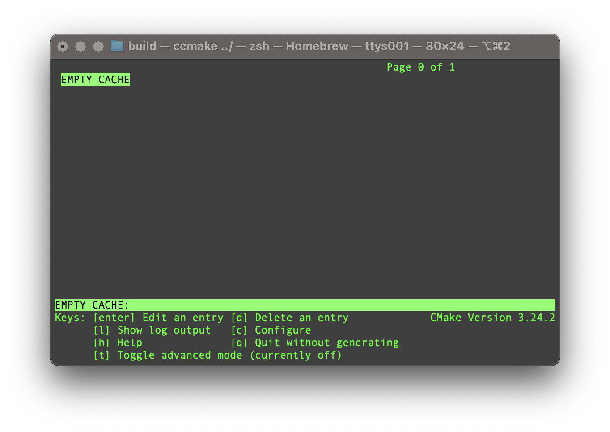
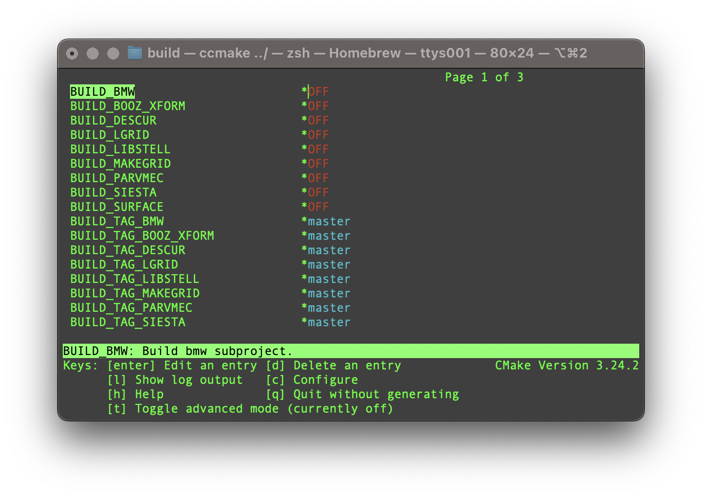
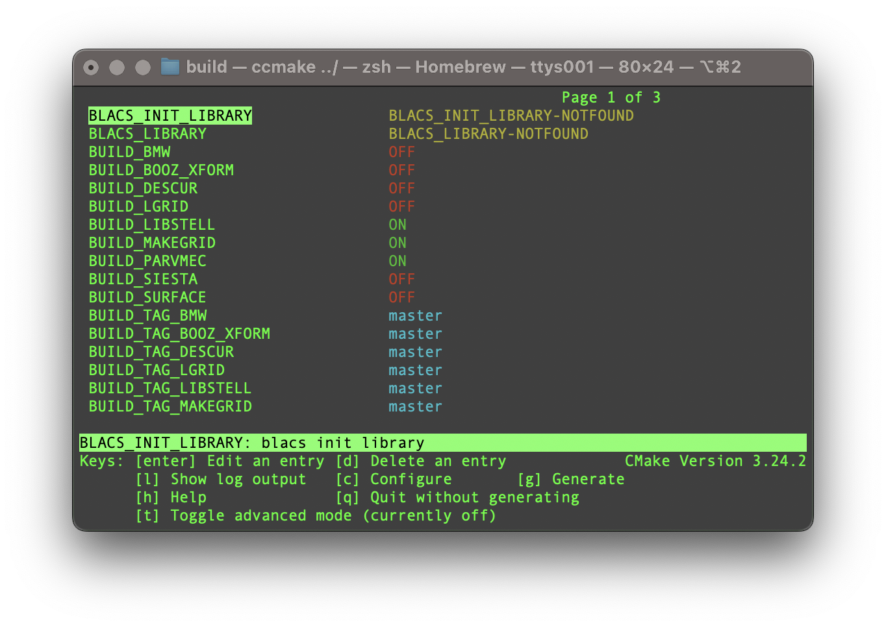

# Stellarator-Tools
This is an umbrella project for the stellarator community tools. Currently available 
subprojects are.

* [LIBSTELL](https://github.com/ORNL-Fusion/LIBSTELL) Base library for tools.
* [MAKEGRID](https://github.com/ORNL-Fusion/MAKEGRID) Generate vacuum fields from coil models. 
* [VMEC](https://github.com/ORNL-Fusion/PARVMEC) 3D Equilibrium solver with nested flux surfaces.
* [DESCUR](https://github.com/ORNL-Fusion/DESCUR) Spectrally condensed curve fitting with Fourier series.
* [BMW](https://github.com/ORNL-Fusion/BMW) Bio-savart Magnetic VMEC Vector potential.
* [SURFACE](https://github.com/ORNL-Fusion/SURFACE) Compute vector potential at firstwall surfaces. 
* [LGRID](https://github.com/ORNL-Fusion/LGRID) Limiter grid preprocessor. 
* [SIESTA](https://github.com/ORNL-Fusion/SIESTA) 3D Equilibrium solver with islands.
* [V3RFUN](https://github.com/ORNL-Fusion/V3RFUN) Magnetic diagnostic responce functions.
* [V3FIT](https://github.com/cianciosa/V3FIT) 3D Equilibrium Reconstruction
* [BOOZ_XFORM](https://github.com/ORNL-Fusion/BOOZ_XFORM.git) Convert VMEC coordinates to Boozer coordinates.

#  Documentation
* [VMEC-internals](https://github.com/jonathanschilling/vmec-internals) Some VMEC-internal documentation

# Testing
[](https://github.com/ORNL-Fusion/Stellarator-Tools/actions/workflows/ci_test.yaml)

# Compiling
To compile the code, first clone this repository.

```
git clone https://github.com/ORNL-Fusion/Stellarator-Tools.git
```

A `Stellarator-Tools` directory will be created. In this directory create a `build` directory and navigate to it.

```
cd Stellarator-Tools
mkdir build
cd build
```

It's recommended that you use the `ccmake` to configure the build system. From inside the build directory, run the `ccmake` command

```
ccmake ../
```

Initally, there will be no options.



press the `c` key to configure. Once configured, there will be sever option. Different code in the Stellarator Tools suite of code can be configured to be build by toggling the `BUILD_<CODE>` from `off` to `on`. The build system will automatically turn on any dependencies. You can also set new options like the `CMAKE_BUILD_TYPE`. 



After changing settings, keep pressing `c` until the `g` option appears.



After hitting `g` option `ccmake` will exit and a `Makefile` will be generated. The codes can be built using the `make` command.

## Touble Shooting
If `cmake` fails to fine the correct libraries, you may need to set the `CMAKE_PREFIX_PATH` variable to help locate them.

